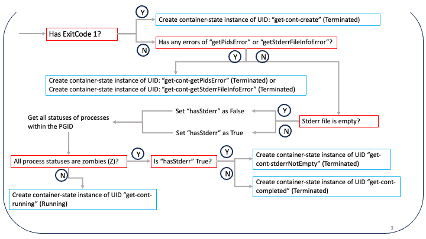
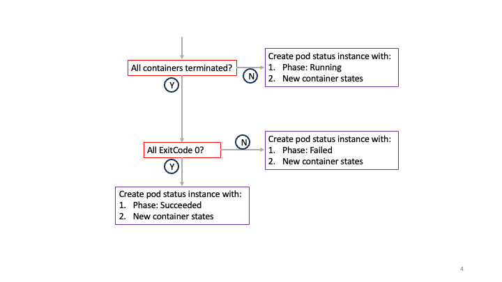

# Configuration for starting virtual-kubelet-cmd
## Environment variables
| Environment Variable      | Description |
| ----------- | ----------- |
| `MAIN`      | Main workspace directory       |
| `VK_PATH`   | Path to the directory containing the apiserver files     |
| `VK_BIN`    | Path to the binary files       |
| `APISERVER_CERT_LOCATION`| Location of the apiserver certificate |
| `APISERVER_KEY_LOCATION` | Location of the apiserver key |
| `KUBECONFIG` | Points to the location of the Kubernetes configuration file, which is used to connect to the Kubernetes API server. By default, it's located at `$HOME/.kube/config`. |
| `NODENAME` | The name of the node in the Kubernetes cluster. |
| `VKUBELET_POD_IP` | The IP address of the VK that metrics server talks to. If the metrics server is running in a Docker container and VK is running on the same host, this is typically the IP address of the `docker0` interface. |
| `KUBELET_PORT` | The port on which the Kubelet service is running. The default port for Kubelet is 10250. This is for the metrics server and should be unique for each node. |
| `JIRIAF_WALLTIME` | Sets a limit on the total time that a node can run. It should be a multiple of 60 and is measured in seconds. If it's set to 0, there is no time limit. |
| `JIRIAF_NODETYPE` | Specifies the type of node that the job will run on. This is just for labeling purposes and doesn't affect the actual job. |
| `JIRIAF_SITE` | Used to specify the site where the job will run. This is just for labeling purposes and doesn't affect the actual job. |

## Using Shell Scripts to Launch
The `test-run/start.sh` script provides an example of how to initiate the VK. It does this by setting up specific environment variables.
```bash
#!/bin/bash
export MAIN="/workspaces/virtual-kubelet-cmd"
export VK_PATH="$MAIN/test-run/apiserver"
export VK_BIN="$MAIN/bin"

export APISERVER_CERT_LOCATION="$VK_PATH/client.crt"
export APISERVER_KEY_LOCATION="$VK_PATH/client.key"
export KUBECONFIG="$HOME/.kube/config"

export NODENAME="vk"
export VKUBELET_POD_IP="172.17.0.1"
export KUBELET_PORT="10255" 

export JIRIAF_WALLTIME="60" 
export JIRIAF_NODETYPE="cpu"
export JIRIAF_SITE="Local"

"$VK_BIN/virtual-kubelet" --nodename $NODENAME --provider mock --klog.v 3 > ./$NODENAME.log 2>&1 
```

# Executing Pods with Virtual-Kubelet-CMD Nodes
Pods and their respective containers can be executed on Virtual-Kubelet-CMD (VK) nodes. The table below provides a comparison between the functionalities of a VK node and a regular kubelet:

| Feature | Virtual-Kubelet-CMD | Regular Kubelet |
| ------- | ------------------- | --------------- |
| Container | Executes as a series of Linux processes | Runs as a Docker container |
| Image | Defined as a shell script | Defined as a Docker container image |

## Enhanced Features for Script Storage and Execution in Pods
| Feature | Description |
| ------- | ----------- |
| `configMap`/ `secret` | These are used as volume types for storing scripts during the pod launch process |
| `volumes` | This feature is implemented within the pod to manage the use of `configMap` and `secret` |
| `volumeMounts` | This feature is used to relocate scripts to the specified `mountPath`. The `mountPath` is defined as a relative path. Its root is structured as `$HOME/$podName/containers/$containerName` |
| `command` and `args` | These are utilized to execute scripts |
| `env` | This feature is supported for passing environment variables to the scripts running within a container |
| `image` | The `image` corresponds to a `volumeMount` in the container and shares the same name |

## Process Group Management in Containers Using `pgid` files
The `pgid` file is a feature used to manage the process group of a shell script running within a container. Each container has a unique `pgid` file to ensure process management. The `pgid` can be found at the following location: `$HOME/$podName/containers/$containerName/pgid`.


# Lifecycle of containers and pods
## Description of container states
The following tables provide a description of the container states and their associated methods.
### CreatePod method called, the following states are used:
| UID | Stage | State | StartAt | FinishedAt | ExitCode | Reason | Message | IsError | Description |
| --- | --- | --- | --- | --- | --- | --- | --- | --- | --- |
| create-cont-readDefaultVolDirError | CreatePod | Terminated | Start of pod | Now | 1 | readDefaultVolDirError | fmt.Sprintf("Failed to read default volume directory %s; error: %v", defaultVolumeDirectory, err) | Y | Scan the default volume directory for files |
| create-cont-copyFileError | CreatePod | Terminated | Start of pod | Now | 1 | copyFileError | fmt.Sprintf("Failed to copy file %s to %s; error: %v", path.Join(defaultVolumeDirectory, file.Name()), path.Join(mountDirectory, file.Name()), err) | Y | Copy the file to the mount directory |
| create--cont-cmdStartError | CreatePod | Terminated | Start of pod | Now | 1 | cmdStartError | "cmd.Start() failed" | Y | The command is initiated with cmd.Start(). |
| create-cont-getPgidError | CreatePod | Terminated | Start of pod | Now | 1 | getPgidError | "failed to get pgid" | Y | The process group id is retrieved using syscall.Getpgid(cmd.Process.Pid). |
| create-cont-createStdoutFileError | CreatePod | Terminated | Start of pod | Now | 1 | createStdoutFileError | "failed to create stdout file" | Y | The stdout file is created using os.Create(path.Join(stdoutPath, "stdout")). |
| create-cont-createStderrFileError | CreatePod | Terminated | Start of pod | Now | 1 | createStderrFileError | "failed to create stderr file" | Y | The stderr file is created using os.Create(path.Join(stdoutPath, "stderr")). |
| create-cont-cmdWaitError | CreatePod | Terminated | Start of pod | Now | 1 | cmdWaitError | "cmd.Wait() failed" | Y | A goroutine is initiated to wait for the command to complete with cmd.Wait() |
| create-cont-writePgidError | CreatePod | Terminated | Start of pod | Now | 1 | writePgidError | fmt.Sprintf("failed to write pgid to file %s; error: %v", pgidFile, err) | Y | Write the process group ID to a file |
| create-cont-containerStarted | CreatePod | Running | Start of pod | nan | nan | nan | nan | N | No error; init container state |

### GetPods method called, the following states are used:
| UID | Stage | State | StartAt | FinishedAt | ExitCode | Reason | Message | IsError | Description |
| --- | --- | --- | --- | --- | --- | --- | --- | --- | --- |
| get-cont-create | GetPods | Terminated | Prev | Prev | 1 | from those with ExitCode 1 | from those with ExitCode 1 | Y | Container failed to start |
| get-cont-getPidsError | GetPods | Terminated | Prev | Prev | 2 | getPidsError | Error getting pids | Y | Failed to get system PIDs |
| get-cont-getStderrFileInfoError | GetPods | Terminated | Prev | Prev | 2 | getStderrFileInfoError | Error getting stderr file info | Y | Failed to get info about stderr file of container |
| get-cont-stderrNotEmpty | GetPods | Terminated | Prev | Prev | 3 | stderrNotEmpty | The stderr file is not empty. | N | All processes are in Z. Stderr is not empty. Container is done with errors. |
| get-cont-completed | GetPods | Terminated | Prev | Prev | 0 | completed | Remaining processes are zombies | N | All processes are in Z. Stderr is empty. Container is done without errors. |
| get-cont-running | GetPods | Running | Prev | nan | nan | nan | nan | N | Not all processes are in Z. Container is running. |

### Field Descriptions
| Field        | Description |
|--------------|-------------|
| `UID`        | A unique identifier for container state. |
| `Stage`      | Method that container state is associated with. |
| `State`      | State of container. |
| `StartAt`    | Get time container started. `Prev` means time of previous state. `Now` means current time. |
| `FinishedAt` | Get time container finished. `Prev` means time of previous state. `Now` means current time. |
| `ExitCode`   | Exit code of container. |
| `Reason`     | Reason for container's state. `1`: Errors when `createPod` is called. `2`: Errors when `getPods` is called. `3`: stderr file is not empty. `0`: Container is completed. |
| `Message`    | Message associated with container's state. |
| `IsError`    | Boolean value that indicates whether container state is an error. |
| `Description`| Description of container's state. |

**Note:** The method `GetPods` is called every 5 seconds to check the state of the container. The method `CreatePod` is called when the pod is created.


## The flowchart for creating and monitoring lifecycle of containers and pods
These figures show how continers and pods are created and monitored in the virtual-kubelet-cmd.
1. Any flows in the `🔄 all containers` block are looped over all containers in the pod.
2. Blues blocks are the flows for creating container state instances.
3. Purple blocks are the flows for creating and updating the pod status instances based on the created container states and pod phase.
4. Red blocks are the flows for re-directing the flows under various conditions.






For example, take the following `configMap.yaml` and `pod.yaml` as an example:
```yaml
kind: ConfigMap
apiVersion: v1
metadata:
  name: direct-stress
data:
  stress.sh: |
    #!/bin/bash
    stress --timeout $1 --cpu $2 # test memory
---
apiVersion: v1
kind: Pod
metadata:
  name: p1
  labels:
    app: new-test-pod
spec:
  containers:
    - name: c1
      image: direct-stress # this name should be the same as the name in the volumeMounts
      command: ["bash"]
      args: ["300", "2"] # the first argument is the timeout, and the second argument is the cpu number as defined in the stress.sh
      volumeMounts:
        - name: direct-stress
          mountPath: stress/job1 # the root path of the mountPath is $HOME/p1/containers/c1
  volumes:
    - name: direct-stress 
      configMap:
        name: direct-stress
```

# Run pod with VK nodes
- To run pod with VK nodes, the labels in `nodeSelector` and `tolerations` are required. 
```yaml
nodeSelector:
    kubernetes.io/role: agent
tolerations:
  - key: "virtual-kubelet.io/provider"
    value: "mock"
    effect: "NoSchedule"
```

# Affinity for pods in VK nodes
- `jiriaf.nodetype`, `jiriaf.site`, and `jiriaf.alivetime` are used to define the affinity of the virtual-kubelet nodes. These labels are defined as the environment variables `JIRIAF_NODETYPE`, `JIRIAF_SITE`, and `JIRIAF_WALLTIME` in the `start.sh` script. 
- Notice that if `JIRIAF_WALLTIME` is set to `0`, the `jiriaf.alivetime` will not be defined and the affinity will not be used.

```yaml
  affinity:
    nodeAffinity:
      requiredDuringSchedulingIgnoredDuringExecution:
        nodeSelectorTerms:
        - matchExpressions:
          - key: jiriaf.nodetype
            operator: In
            values:
            - "cpu"
          - key: jiriaf.site
            operator: In
            values:
            - "mylin"
          - key: jiriaf.alivetime # if JIRIAF_WALLTIME is set to 0, this label should not be defined.
            operator: Gt
            values:
            - "10"
```

- To add more labels to the VK nodes, modify `ConfigureNode` in `internal/provider/mock/mock.go`.

# Metrics Server Deployment

The Metrics Server is a tool that collects and provides resource usage data for nodes and pods within a Kubernetes cluster. The necessary deployment configuration is located in the `metrics-server/components.yaml` file.

To deploy the Metrics Server, execute the following command:

```bash
kubectl apply -f metrics-server/components.yaml
```


# Key scripts
The main control of the vk is in the following files:
- `internal/provider/mock/mock.go`
- `internal/provider/mock/command.go`
- `internal/provider/mock/volume.go`


# References
- [virtual-kubelet](https://github.com/virtual-kubelet/virtual-kubelet)
- [systemk](https://github.com/virtual-kubelet/systemk)